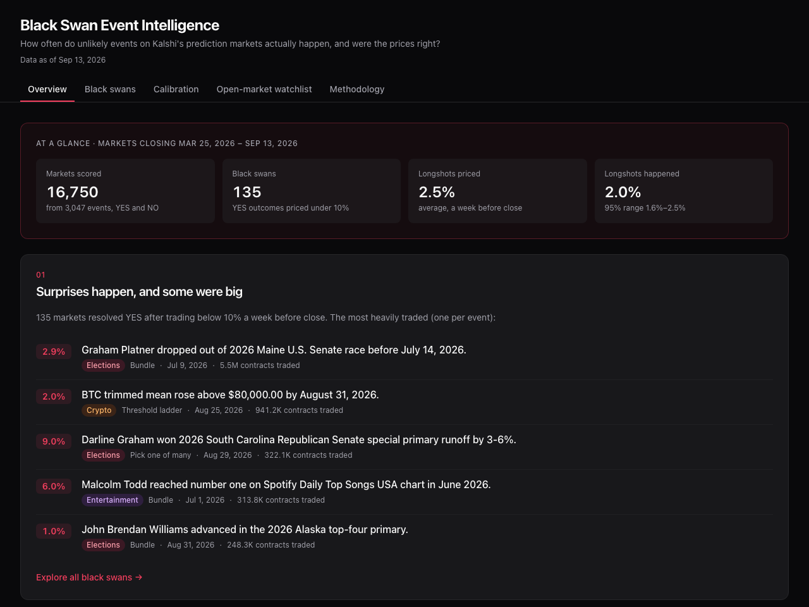
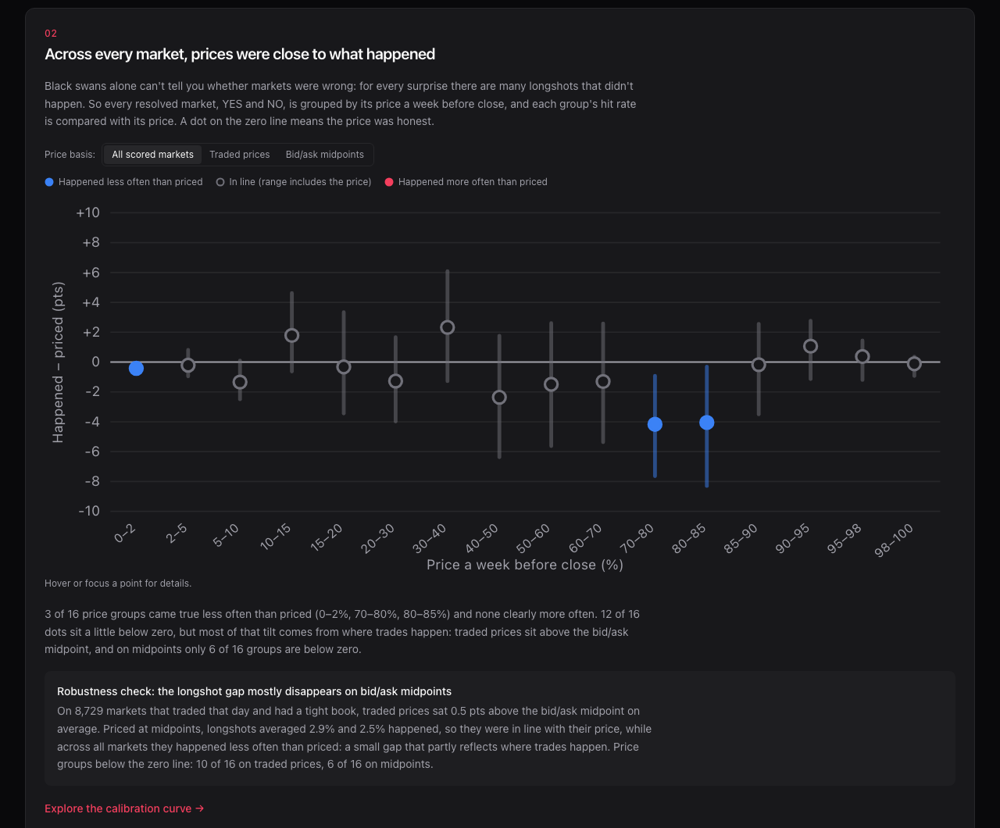
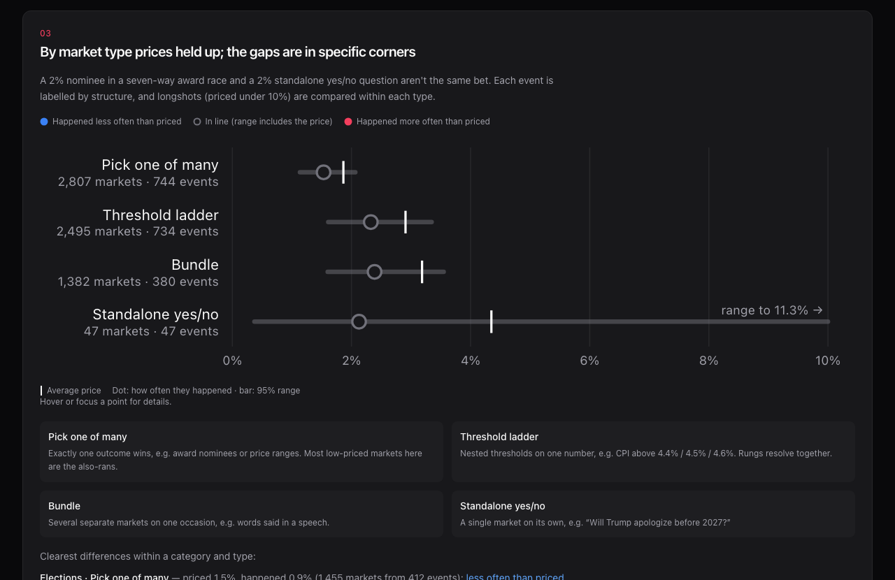
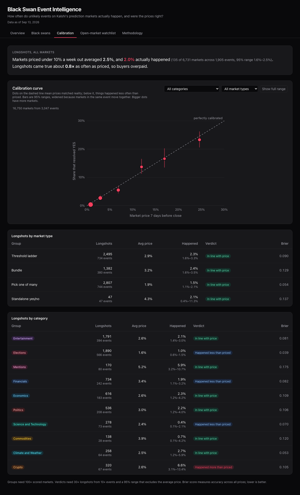
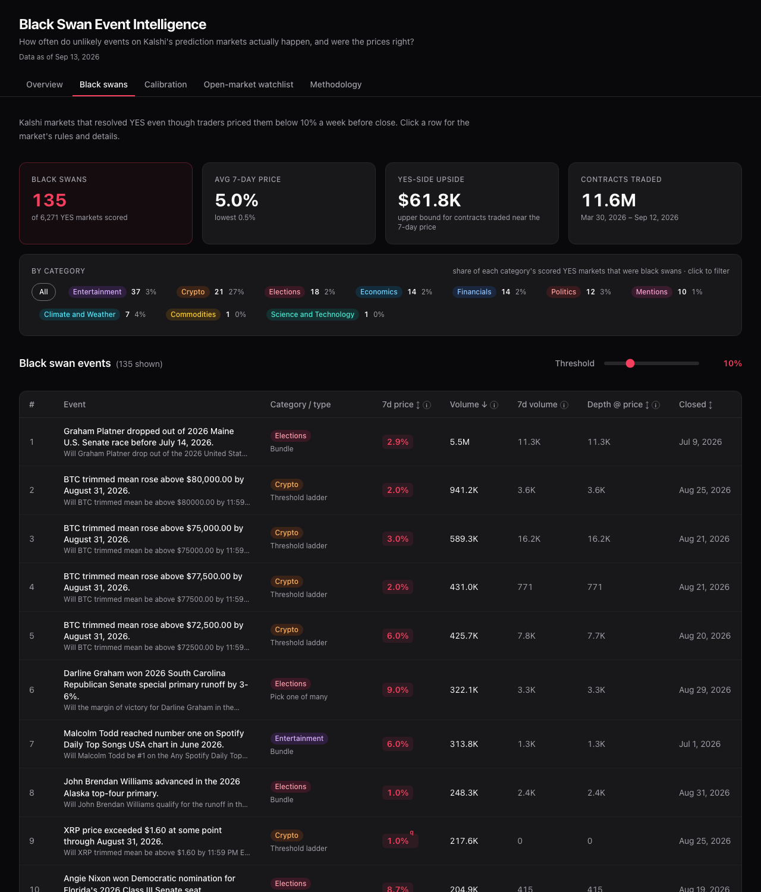
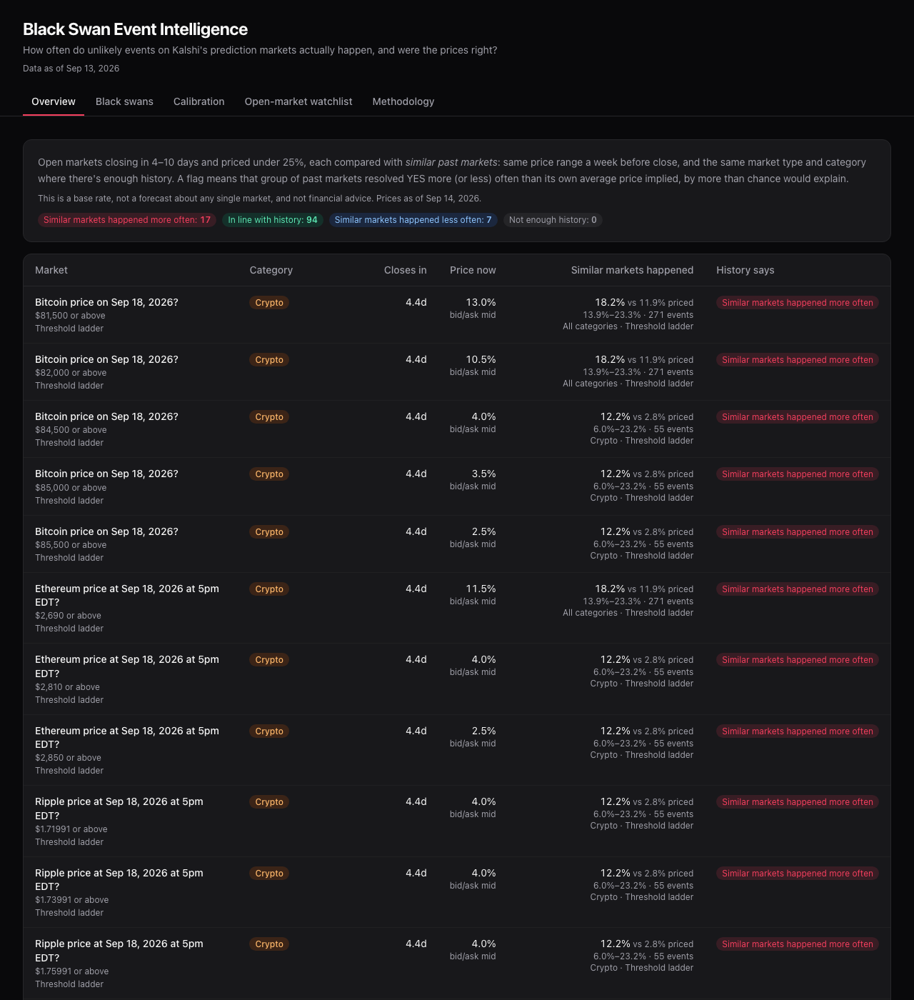
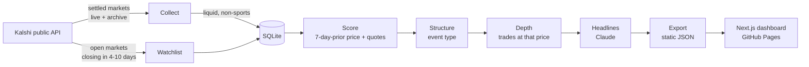

# Black Swan Event Intelligence

**When were prediction markets wrong, and are they wrong in a consistent way?** This project scans every settled [Kalshi](https://kalshi.com) market, reconstructs what traders believed a week before each market closed, and asks three questions:

1. **Black swans:** which outcomes did the crowd price below 10% (configurable up to 25%) that happened anyway?
2. **Calibration:** across *all* resolved markets, when the price said 5%, how often did the event really happen?
3. **Watchlist:** for markets open today, how often did similar past markets (same category, same price range) come true?

**Live dashboard:** https://emilija-tashevska.github.io/black-swan-event-intelligence/

<!-- RESULTS:START -->


## Findings (markets closing Mar 25 – Sep 13, 2026)

Based on **16,750 scored markets from 3,047 events**: every liquid, non-sports Kalshi market open at least 8 days, YES and NO, with a same-day trade or a tight order book a week before close. The dashboard derives its wording from the data, so it stays accurate when the numbers change.

**1. Surprises happen, and some were big.** 135 markets resolved YES after trading below 10% a week before close. The most heavily traded: Graham Platner dropping out of the Maine Senate race (priced 2.9%, 5.5M contracts), BTC's trimmed mean topping $80,000 in August (2.0%), and Darline Graham winning South Carolina's Republican Senate runoff by 3–6 points (9.0%).

**2. Overall, prices were close to reality, with a small lean toward YES happening less often.** Longshots priced under 10% averaged **2.5%** and happened **2.0%** of the time (95% range 1.6–2.5%). Only 3 of 16 price groups clearly came true less often than priced (0–2%, 70–80%, 80–85%), and none clearly more often.



**3. Most of that lean is where trades happen, not what traders believe.** On 8,729 markets that both traded that day and had a tight book, traded prices sat **+0.5 points above the bid/ask midpoint** on average (up to +1.5 in the 40–60% range), because trades tend to lift the ask. Scored on traded prices, 10 of 16 groups sit below zero; scored on midpoints, only 6 of 16 do, and longshots (priced 2.9%, happened 2.5%) are in line with their price.

**4. By market type prices held up; the gaps are in specific corners.**

| Category · market type | Longshots (<10%) | Priced | Happened | 95% range | Verdict |
|---|---|---|---|---|---|
| Elections · pick one of many | 1,455 from 412 events | 1.5% | 0.9% | 0.5–1.5% | Happened less often |
| Entertainment · bundle | 640 from 65 events | 2.5% | 1.1% | 0.5–2.4% | Happened less often |
| Financials · threshold ladder | 608 from 194 events | 3.4% | 2.0% | 1.1–3.4% | Happened less often |
| Crypto · threshold ladder | 320 from 67 events | 2.6% | 6.6% | 3.1–13.4% | Happened more often |

Traders overpay for election also-rans. Crypto ladders go the other way, though daily ladders on the same coin move together, so treat that as a lead rather than a finding. All four market types (pick one, ladder, bundle, standalone) are in line on their own.



**5. The watchlist applies this to markets open now.** Of 118 liquid markets closing within 4–10 days and priced under 25%, 94 look in line with history, 17 sit in groups that happened more often than priced (mostly crypto price ladders) and 7 in groups that happened less often (mostly pick-one election markets).

**A data-quality note.** An earlier version of this analysis fell back to a candle's *previous* price when nothing traded that day. On quiet markets that's the last trade before the day, sometimes weeks old: 7,320 scored markets used it, including a CPI market scored at 2% whose order book sat around 86%. Checking closing quotes exposed it. Those markets were repriced from the order book (6,367) or dropped (953), black swans fell from 151 to 135, and the earlier headline ("longshots are clearly overpriced") weakened to the more careful findings above.

<details>
<summary>More screenshots</summary>





</details>
<!-- RESULTS:END -->

## How it works



| Step | What happens |
|------|--------------|
| **Collect** | Pages through settled markets since the last run (first run: 180 days). Keeps markets with ≥1,000 contracts traded. Sports and multi-leg parlays are excluded using Kalshi's own series categories, fetched once per run from `/series`. |
| **Score** | For each resolved market (YES *and* NO) open at least 8 days (so a full day traded before the 7-day mark), fetches daily candlesticks and takes the **last candle that closed at or before 7 days pre-close**. If contracts traded that day, its closing trade price is the implied probability; if not, the closing bid/ask midpoint is used when the spread is ≤10¢; otherwise the market is marked `no_data`. The candle's closing bid and ask are stored for the midpoint check. |
| **Quotes** | Backfills closing bid/ask for markets scored before quotes were captured, and reprices any market that had fallen back to a stale earlier trade (resumable, idempotent). |
| **Structure** | For every event behind a scored or watchlist market, fetches the event and its market list and labels it standalone, pick-one, ladder or bundle (see below). |
| **Depth** | For black swans, pulls that day's individual trades and sums contracts within ±2¢ of the prediction price: how much money actually stood behind the mispricing. |
| **Headlines** | Claude (Haiku 4.5 by default) turns each market's title and rules into a factual, past-tense headline. Uses structured outputs and matches results by ticker. |
| **Watchlist** | Fetches open markets closing in 4–10 days, keeps liquid in-scope ones priced under 25% (tight bid/ask midpoint, else last trade), and snapshots them. |
| **Export** | Writes one JSON bundle per dashboard threshold (5–25%), the calibration curves, the watchlist with each market's historical base rate, and run metadata, so the site is fully static. |

## Calibration and the watchlist

A forecaster is **well calibrated** if things they call "10% likely" happen about 10% of the time. You can't judge that from one market, but you can from thousands: group every scored market by its 7-day price and count how often each group resolved YES.

- **Buckets** are finer at the extremes (0–2%, 2–5%, 5–10%, …, 98–100%), where longshots and near-certainties sit.
- **Market types.** Every event is labelled from Kalshi's event data, because structure changes what a low price means:

  | Type | Example | Why it matters |
  |---|---|---|
  | Standalone | "Will Trump apologize before 2027?" | One independent yes/no market; the purest test |
  | Pick one of many | Award nominees, price ranges | Exactly one wins, so most cheap markets are mechanically also-rans |
  | Threshold ladder | CPI above 4.4% / 4.5% / 4.6% | Nested rungs on one number resolve together |
  | Bundle | Words said in a speech | Several markets on one occasion |

  Curves are available overall, per category, per type, and per category × type (100+ markets each).
- **Event-adjusted 95% intervals.** Markets from the same event aren't independent draws, so intervals use a Wilson score interval on an *effective* sample size: the market count divided by a design effect estimated from between-event variation. Independent markets get plain Wilson; a ladder whose rungs all resolve together counts as roughly one draw. Event counts are shown next to market counts everywhere.
- **Verdicts are conservative.** A group counts as over- or under-priced only when its whole interval sits on one side of its average price.
- **Brier score** summarizes calibration and sharpness in one number per category (lower is better).
- **Black swans are the YES tail of this same data.** Calibration adds the NO markets that the black-swan view leaves out, which is what shows whether a "surprise" was actually surprising.

The **watchlist** applies those base rates to open markets: "priced at 6% now; similar markets resolved YES 11% of the time (7–16%, 214 markets from 80 events)." It uses the most specific group with enough history (30+ markets from 10+ events in that price bucket): category × type, then type, then category, then all markets. A market is flagged only when its comparison group was itself mispriced (the group's interval excludes the group's own average price), so a market at the edge of a fairly priced bucket isn't flagged by accident. It only considers markets closing in 4–10 days so the horizon matches the 7-day calibration. It is a base-rate comparison, not a forecast for any individual market.

## Methodology decisions

These are the judgment calls that shape the numbers, and why they were made:

- **No lookahead.** The prediction candle must *end* at or before the 7-day mark. Taking the nearest candle can use a price from after the cutoff, which quietly makes the crowd look smarter than it was.
- **Short-lived markets are excluded, not approximated.** Hourly and 15-minute markets make up the large majority of liquid YES resolutions on a typical day. They have no week-ahead price, and scoring them on their last trade (which is often stale in range markets) inflated earlier results. They're counted and reported, but not scored.
- **Official categories over ticker heuristics.** Hand-maintained prefix lists drift as Kalshi launches new series; the `/series` endpoint is the source of truth.
- **No stale prices.** A candle's `previous` field is the last trade *before* that day, which on quiet markets can be weeks old. An earlier version fell back to it for about 4 in 10 scored markets, including a CPI market scored at 2% while its order book sat around 86%. A price now counts only if contracts traded that day or the book was tight.
- **Quotes only when informative.** A 0¢ bid / 6¢ ask is a clear signal; a 15¢ / 90¢ book is not. The price source (`trade` or `quote`) is stored and shown.
- **Robustness on price basis.** Traded prices can sit on the ask or the bid. Calibration is recomputed on markets that both traded that day and had a tight book, once with traded prices and once with midpoints, to check that findings don't depend on which side crossed the spread.
- **Upside is labelled as an upper bound.** `(1 − price) × depth` assumes every YES-side buyer near that price held to settlement.
- **Transient failures retry; empty data doesn't.** Network errors leave a market pending for the next run. Markets with no usable price are marked so they aren't re-fetched forever.

## Project structure

```
backend/
  cli.py          Pipeline entry point (run, collect, score, quotes, structure, depth, headlines, watchlist, export, stats)
  collector.py    Collect / score / depth logic and pure helpers
  kalshi.py       Async Kalshi client: pagination, retries, archive handling
  summaries.py    Claude headline generation (structured outputs)
  calibration.py  Buckets, event-adjusted Wilson intervals, Brier scores, midpoint robustness check
  structure.py    Event types: standalone, pick-one, ladder, bundle
  watchlist.py    Open-market snapshot and base-rate matching
  database.py     SQLite schema and all shared queries
  export.py       Static JSON export
  main.py         Read-only FastAPI app for local development
  config.py       Every tunable in one place
  tests/          pytest suite with real Kalshi response fixtures
frontend/
  src/app/        Next.js App Router page with linkable tabs
  src/components/ Overview story, charts, black swan table, calibration, watchlist, methodology
  src/lib/        API client (live API or static JSON), data-derived findings, formatting, tests
scripts/
  update_and_deploy.sh   Pipeline → tests → static build → gh-pages
```

## Running it

Requirements: [uv](https://docs.astral.sh/uv/) (installs Python 3.12 for you) and Node 20.9+.

```bash
# Backend
cd backend
uv sync
cp .env.example .env          # add ANTHROPIC_API_KEY for headlines
uv run python cli.py run      # full pipeline; the first 6-month run takes several hours and resumes if interrupted
uv run python cli.py stats    # quick look at the results
uv run uvicorn main:app --reload --port 8000

# Frontend (separate terminal)
cd frontend
npm install
npm run dev                   # http://localhost:3000, reads the local API
```

Individual steps can be re-run on their own, e.g. `uv run python cli.py headlines --force` to regenerate every headline after a prompt change. Later `collect` runs are incremental.

## Tests

```bash
cd backend && uv run pytest        # 136 tests: client, pipeline, SQL, calibration, structures, quotes, watchlist, Claude, API
cd frontend && npm test            # 35 tests: findings, robustness, calibration verdicts, sorting/filtering, static fetching, formatting
```

Backend tests run against a throwaway SQLite database and fake Kalshi/Claude clients, with fixtures captured from real API responses. No network is used. GitHub Actions runs lint, type checks, both test suites and a static build on every push.

## Deploying

```bash
./scripts/update_and_deploy.sh               # refresh data, test, build, push gh-pages
SKIP_PIPELINE=1 ./scripts/update_and_deploy.sh   # redeploy existing data
```

## Limitations and next steps

- **Events in the same series can be related too.** Intervals account for markets sharing an event, but not for correlation across events (e.g. consecutive weekly CPI ladders reacting to the same news).
- **Calibration drifts.** Base rates from the last six months may not hold as Kalshi's user base and market mix change; the watchlist inherits that.
- **Closing quotes and last trades aren't simultaneous.** The candle's closing bid/ask is at the end of the day, while its last trade may be hours earlier, so the midpoint comparison mixes a little timing noise into the price-basis check.
- **One snapshot per market.** A single 7-day price can't show whether the crowd was consistently wrong or whether news broke the day after.
- **Liquidity varies.** Depth @ price helps, but a thinly traded 3% print is weaker evidence than a heavily traded one.

## Tech stack

Python 3.12 · httpx · aiosqlite · FastAPI · Anthropic SDK (Claude Haiku 4.5) · pytest · Next.js 16 · React 19 · Tailwind CSS 4 · Vitest · GitHub Actions · GitHub Pages

---

Data from Kalshi's public API. Not affiliated with Kalshi. Not financial advice.
