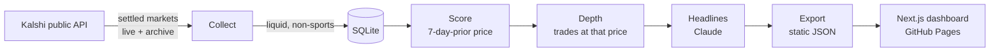

# Black Swan Event Intelligence

**When were prediction markets wrong?** This project scans every settled [Kalshi](https://kalshi.com) market, reconstructs what traders believed a week before each market closed, and surfaces the events that happened anyway: outcomes the crowd priced below 10% (configurable up to 25%) that resolved **YES**.

**Live dashboard:** https://emilija-tashevska.github.io/black-swan-event-intelligence/

<!-- RESULTS:START -->
<!-- RESULTS:END -->

## How it works



| Step | What happens |
|------|--------------|
| **Collect** | Pages through settled markets since the last run (first run: 180 days). Keeps markets with ≥1,000 contracts traded. Sports and multi-leg parlays are excluded using Kalshi's own series categories, fetched once per run from `/series`. |
| **Score** | For each YES-resolved market open at least 8 days (so a full day traded before the 7-day mark), fetches daily candlesticks and takes the **last candle that closed at or before 7 days pre-close**. Its closing trade price is the implied probability. If nothing traded that day, the closing bid/ask midpoint is used when the spread is ≤10¢; otherwise the market is marked `no_data`. |
| **Depth** | For black swans, pulls that day's individual trades and sums contracts within ±2¢ of the prediction price: how much money actually stood behind the mispricing. |
| **Headlines** | Claude (Haiku 4.5 by default) turns each market's title and rules into a factual, past-tense headline. Uses structured outputs and matches results by ticker. |
| **Export** | Writes one JSON bundle per dashboard threshold (5–25%) plus run metadata, so the site is fully static. |

## Methodology decisions

These are the judgment calls that shape the numbers, and why they were made:

- **No lookahead.** The prediction candle must *end* at or before the 7-day mark. Taking the nearest candle can use a price from after the cutoff, which quietly makes the crowd look smarter than it was.
- **Short-lived markets are excluded, not approximated.** Hourly and 15-minute markets make up the large majority of liquid YES resolutions on a typical day. They have no week-ahead price, and scoring them on their last trade (which is often stale in range markets) inflated earlier results. They're counted and reported, but not scored.
- **Official categories over ticker heuristics.** Hand-maintained prefix lists drift as Kalshi launches new series; the `/series` endpoint is the source of truth.
- **Quotes only when informative.** A 0¢ bid / 6¢ ask is a clear signal; a 15¢ / 90¢ book is not. The price source (`trade` or `quote`) is stored and shown.
- **Upside is labelled as an upper bound.** `(1 − price) × depth` assumes every YES-side buyer near that price held to settlement.
- **Transient failures retry; empty data doesn't.** Network errors leave a market pending for the next run. Markets with no usable price are marked so they aren't re-fetched forever.

## Project structure

```
backend/
  cli.py          Pipeline entry point (run, collect, score, depth, headlines, export, stats)
  collector.py    Collect / score / depth logic and pure helpers
  kalshi.py       Async Kalshi client: pagination, retries, archive handling
  summaries.py    Claude headline generation (structured outputs)
  database.py     SQLite schema and all shared queries
  export.py       Static JSON export
  main.py         Read-only FastAPI app for local development
  config.py       Every tunable in one place
  tests/          pytest suite with real Kalshi response fixtures
frontend/
  src/app/        Next.js App Router page
  src/components/ Stats cards, table, threshold slider
  src/lib/        API client (live API or static JSON), formatting, tests
scripts/
  update_and_deploy.sh   Pipeline → tests → static build → gh-pages
```

## Running it

Requirements: [uv](https://docs.astral.sh/uv/) (installs Python 3.12 for you) and Node 20.9+.

```bash
# Backend
cd backend
uv sync
cp .env.example .env          # add ANTHROPIC_API_KEY for headlines
uv run python cli.py run      # full pipeline; first run takes a couple of hours
uv run python cli.py stats    # quick look at the results
uv run uvicorn main:app --reload --port 8000

# Frontend (separate terminal)
cd frontend
npm install
npm run dev                   # http://localhost:3000, reads the local API
```

Individual steps can be re-run on their own, e.g. `uv run python cli.py headlines --force` to regenerate every headline after a prompt change. Later `collect` runs are incremental.

## Tests

```bash
cd backend && uv run pytest        # 70+ tests: client, pipeline, SQL, Claude integration, API
cd frontend && npm test            # sorting/filtering, static-mode fetching, formatting
```

Backend tests run against a throwaway SQLite database and fake Kalshi/Claude clients, with fixtures captured from real API responses. No network is used. GitHub Actions runs lint, type checks, both test suites and a static build on every push.

## Deploying

```bash
./scripts/update_and_deploy.sh               # refresh data, test, build, push gh-pages
SKIP_PIPELINE=1 ./scripts/update_and_deploy.sh   # redeploy existing data
```

## Limitations and next steps

- **Selection, not calibration.** The dashboard shows YES outcomes that were priced low. It doesn't yet show how often *all* markets priced at 5% resolve YES, which would tell you whether 5% really means 5%. Scoring NO-resolved markets too would enable a proper calibration curve.
- **One snapshot per market.** A single 7-day price can't show whether the crowd was consistently wrong or whether news broke the day after.
- **Liquidity varies.** Depth @ price helps, but a thinly traded 3% print is weaker evidence than a heavily traded one.

## Tech stack

Python 3.12 · httpx · aiosqlite · FastAPI · Anthropic SDK (Claude Haiku 4.5) · pytest · Next.js 16 · React 19 · Tailwind CSS 4 · Vitest · GitHub Actions · GitHub Pages

---

Data from Kalshi's public API. Not affiliated with Kalshi. Not financial advice.
