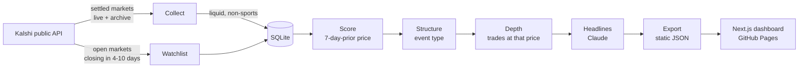

# Black Swan Event Intelligence

**When were prediction markets wrong, and are they wrong in a consistent way?** This project scans every settled [Kalshi](https://kalshi.com) market, reconstructs what traders believed a week before each market closed, and asks three questions:

1. **Black swans:** which outcomes did the crowd price below 10% (configurable up to 25%) that happened anyway?
2. **Calibration:** across *all* resolved markets, when the price said 5%, how often did the event really happen?
3. **Watchlist:** for markets open today, how often did similar past markets (same category, same price range) come true?

**Live dashboard:** https://emilija-tashevska.github.io/black-swan-event-intelligence/

<!-- RESULTS:START -->
<!-- RESULTS:END -->

## How it works



| Step | What happens |
|------|--------------|
| **Collect** | Pages through settled markets since the last run (first run: 180 days). Keeps markets with ≥1,000 contracts traded. Sports and multi-leg parlays are excluded using Kalshi's own series categories, fetched once per run from `/series`. |
| **Score** | For each resolved market (YES *and* NO) open at least 8 days (so a full day traded before the 7-day mark), fetches daily candlesticks and takes the **last candle that closed at or before 7 days pre-close**. Its closing trade price is the implied probability. If nothing traded that day, the closing bid/ask midpoint is used when the spread is ≤10¢; otherwise the market is marked `no_data`. |
| **Structure** | For every event behind a scored or watchlist market, fetches the event and its market list and labels it standalone, pick-one, ladder or bundle (see below). |
| **Depth** | For black swans, pulls that day's individual trades and sums contracts within ±2¢ of the prediction price: how much money actually stood behind the mispricing. |
| **Headlines** | Claude (Haiku 4.5 by default) turns each market's title and rules into a factual, past-tense headline. Uses structured outputs and matches results by ticker. |
| **Watchlist** | Fetches open markets closing in 4–10 days, keeps liquid in-scope ones priced under 25% (tight bid/ask midpoint, else last trade), and snapshots them. |
| **Export** | Writes one JSON bundle per dashboard threshold (5–25%), the calibration curves, the watchlist with each market's historical base rate, and run metadata, so the site is fully static. |

## Calibration and the watchlist

A forecaster is **well calibrated** if things they call "10% likely" happen about 10% of the time. You can't judge that from one market, but you can from thousands: group every scored market by its 7-day price and count how often each group resolved YES.

- **Buckets** are finer at the extremes (0–2%, 2–5%, 5–10%, …, 98–100%), where longshots and near-certainties sit.
- **Market types.** Every event is labelled from Kalshi's event data, because structure changes what a low price means:

  | Type | Example | Why it matters |
  |---|---|---|
  | Standalone | "Will Trump apologize before 2027?" | One independent yes/no market; the purest test |
  | Pick one of many | Award nominees, price ranges | Exactly one wins, so most cheap markets are mechanically also-rans |
  | Threshold ladder | CPI above 4.4% / 4.5% / 4.6% | Nested rungs on one number resolve together |
  | Bundle | Words said in a speech | Several markets on one occasion |

  Curves are available overall, per category, per type, and per category × type (100+ markets each).
- **Event-adjusted 95% intervals.** Markets from the same event aren't independent draws, so intervals use a Wilson score interval on an *effective* sample size: the market count divided by a design effect estimated from between-event variation. Independent markets get plain Wilson; a ladder whose rungs all resolve together counts as roughly one draw. Event counts are shown next to market counts everywhere.
- **Verdicts are conservative.** A group counts as over- or under-priced only when its whole interval sits on one side of its average price.
- **Brier score** summarizes calibration and sharpness in one number per category (lower is better).
- **Black swans are the YES tail of this same data.** Calibration adds the NO markets that the black-swan view leaves out, which is what shows whether a "surprise" was actually surprising.

The **watchlist** applies those base rates to open markets: "priced at 6% now; similar markets resolved YES 11% of the time (7–16%, 214 markets from 80 events)." It uses the most specific group with enough history (30+ markets from 10+ events in that price bucket): category × type, then type, then category, then all markets. A market is flagged only when its comparison group was itself mispriced (the group's interval excludes the group's own average price), so a market at the edge of a fairly priced bucket isn't flagged by accident. It only considers markets closing in 4–10 days so the horizon matches the 7-day calibration. It is a base-rate comparison, not a forecast for any individual market.

## Methodology decisions

These are the judgment calls that shape the numbers, and why they were made:

- **No lookahead.** The prediction candle must *end* at or before the 7-day mark. Taking the nearest candle can use a price from after the cutoff, which quietly makes the crowd look smarter than it was.
- **Short-lived markets are excluded, not approximated.** Hourly and 15-minute markets make up the large majority of liquid YES resolutions on a typical day. They have no week-ahead price, and scoring them on their last trade (which is often stale in range markets) inflated earlier results. They're counted and reported, but not scored.
- **Official categories over ticker heuristics.** Hand-maintained prefix lists drift as Kalshi launches new series; the `/series` endpoint is the source of truth.
- **Quotes only when informative.** A 0¢ bid / 6¢ ask is a clear signal; a 15¢ / 90¢ book is not. The price source (`trade` or `quote`) is stored and shown.
- **Upside is labelled as an upper bound.** `(1 − price) × depth` assumes every YES-side buyer near that price held to settlement.
- **Transient failures retry; empty data doesn't.** Network errors leave a market pending for the next run. Markets with no usable price are marked so they aren't re-fetched forever.

## Project structure

```
backend/
  cli.py          Pipeline entry point (run, collect, score, structure, depth, headlines, watchlist, export, stats)
  collector.py    Collect / score / depth logic and pure helpers
  kalshi.py       Async Kalshi client: pagination, retries, archive handling
  summaries.py    Claude headline generation (structured outputs)
  calibration.py  Buckets, event-adjusted Wilson intervals, Brier scores
  structure.py    Event types: standalone, pick-one, ladder, bundle
  watchlist.py    Open-market snapshot and base-rate matching
  database.py     SQLite schema and all shared queries
  export.py       Static JSON export
  main.py         Read-only FastAPI app for local development
  config.py       Every tunable in one place
  tests/          pytest suite with real Kalshi response fixtures
frontend/
  src/app/        Next.js App Router page
  src/components/ Black swan table, calibration chart, watchlist, stats
  src/lib/        API client (live API or static JSON), formatting, tests
scripts/
  update_and_deploy.sh   Pipeline → tests → static build → gh-pages
```

## Running it

Requirements: [uv](https://docs.astral.sh/uv/) (installs Python 3.12 for you) and Node 20.9+.

```bash
# Backend
cd backend
uv sync
cp .env.example .env          # add ANTHROPIC_API_KEY for headlines
uv run python cli.py run      # full pipeline; first run takes a couple of hours
uv run python cli.py stats    # quick look at the results
uv run uvicorn main:app --reload --port 8000

# Frontend (separate terminal)
cd frontend
npm install
npm run dev                   # http://localhost:3000, reads the local API
```

Individual steps can be re-run on their own, e.g. `uv run python cli.py headlines --force` to regenerate every headline after a prompt change. Later `collect` runs are incremental.

## Tests

```bash
cd backend && uv run pytest        # ~100 tests: client, pipeline, SQL, calibration, watchlist, Claude, API
cd frontend && npm test            # sorting/filtering, static-mode fetching, calibration verdicts, formatting
```

Backend tests run against a throwaway SQLite database and fake Kalshi/Claude clients, with fixtures captured from real API responses. No network is used. GitHub Actions runs lint, type checks, both test suites and a static build on every push.

## Deploying

```bash
./scripts/update_and_deploy.sh               # refresh data, test, build, push gh-pages
SKIP_PIPELINE=1 ./scripts/update_and_deploy.sh   # redeploy existing data
```

## Limitations and next steps

- **Events in the same series can be related too.** Intervals account for markets sharing an event, but not for correlation across events (e.g. consecutive weekly CPI ladders reacting to the same news).
- **Calibration drifts.** Base rates from the last six months may not hold as Kalshi's user base and market mix change; the watchlist inherits that.
- **One snapshot per market.** A single 7-day price can't show whether the crowd was consistently wrong or whether news broke the day after.
- **Liquidity varies.** Depth @ price helps, but a thinly traded 3% print is weaker evidence than a heavily traded one.

## Tech stack

Python 3.12 · httpx · aiosqlite · FastAPI · Anthropic SDK (Claude Haiku 4.5) · pytest · Next.js 16 · React 19 · Tailwind CSS 4 · Vitest · GitHub Actions · GitHub Pages

---

Data from Kalshi's public API. Not affiliated with Kalshi. Not financial advice.
